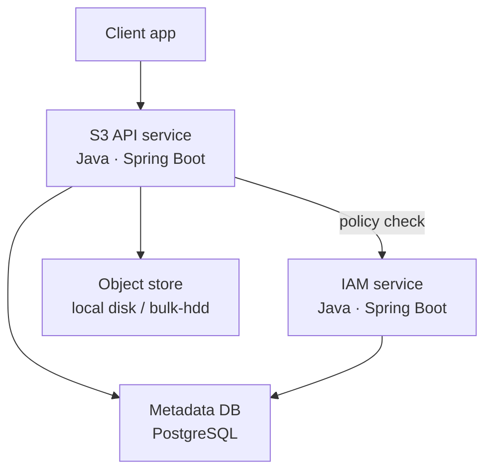
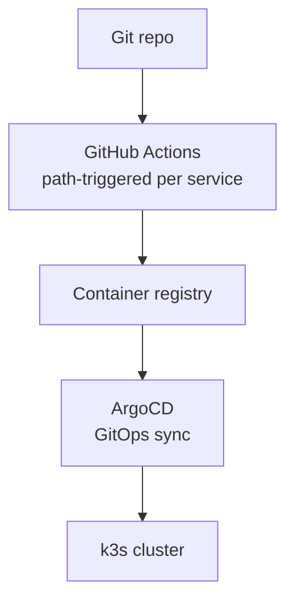

# CloudLite

A self-hosted, Kubernetes-native clone of a small slice of AWS — **S3 + IAM +
Lambda-style functions** — built to demonstrate backend engineering and
platform/SRE engineering depth from a single codebase, running on a single
bare-metal k3s node.

Two services (S3, IAM) with a real policy-evaluation dependency between them,
deployed through Helm + ArgoCD GitOps + GitHub Actions CI, with the same repo
telling a backend story or a platform story depending on the interview.

Full design rationale lives in [`docs/architecture.md`](docs/architecture.md)
and [`docs/decisions/`](docs/decisions/) (one ADR per major decision — why
Java, why bare-metal k3s, why PLG over ELK, etc.).

## Architecture





## Status

Built in dependency order — see [`docs/architecture.md` §11](docs/architecture.md#11-build-order)
for the full plan.

| Layer | Status |
|---|---|
| S3 clone (bucket CRUD, object PUT/GET/DELETE/HEAD) | ✅ Built (Java/Spring Boot) |
| S3: byte-range GET, versioning, multipart upload | ⏳ Not yet built |
| IAM clone (users/roles/policies, deny-overrides-allow engine, JWT auth) | ✅ Built |
| IAM wired into S3 (policy check on every request, fails closed) | ✅ Built |
| Helm charts (umbrella chart, per-service subcharts) | ✅ Built |
| CI/CD (GitHub Actions, path-triggered) | ✅ Built |
| ArgoCD GitOps sync | ✅ Built |
| Sealed Secrets | ✅ Built |
| Prometheus + Grafana + Loki observability | ⏳ Not yet built |
| Chaos test | ⏳ Not yet built |
| Function runner (Lambda-style, stretch goal) | ⏳ Not yet built |
| Web admin console | ⏳ Not yet built |

Per-service status detail: [`docs/services/`](docs/services/) (`s3.md`,
`iam.md`, `fnrunner.md`, `web.md`).

## Tech stack

| Layer | Choice |
|---|---|
| S3 / IAM services | Java 21, Spring Boot (virtual threads), PostgreSQL + Flyway |
| Function runner (planned) | Go, Python guest runtime |
| Web console (planned) | React |
| Deployment | Helm (umbrella + subcharts) |
| GitOps | ArgoCD |
| CI/CD | GitHub Actions, path-triggered per service |
| Secrets | Sealed Secrets |
| Observability (planned) | Prometheus, Grafana, Loki |
| Cluster | Bare-metal k3s, single node |

Rationale for each choice: [`docs/decisions/`](docs/decisions/).

## Running locally

```bash
docker compose up --build
```

Brings up Postgres, the IAM service (`:8081`), and the S3 service (`:8080`,
IAM-backed — every request except `/healthz` requires a JWT obtained from
IAM's `/auth/token`). No Kubernetes required for local dev.

For the k3s/Helm/ArgoCD deployment path, see
[`docs/platform/helm-charts.md`](docs/platform/helm-charts.md) and
[`docs/platform/argocd.md`](docs/platform/argocd.md).

## Repo structure

```
services/
├── s3/     # Java (Spring Boot) — buckets, objects, iamclient
└── iam/    # Java (Spring Boot) — users, roles, policy engine, JWT auth
deploy/
├── helm/argocd/   # umbrella Helm chart, ArgoCD install + Application manifests
docs/
├── architecture.md     # full architecture and decision reference
├── future-work.md      # explicit scope fence — what's deliberately cut, and why
├── decisions/          # one ADR per major decision
├── services/           # one file per service — scope + status
└── platform/           # Helm/CI/CD/ArgoCD sub-project docs
```

## Scope

What's deliberately *not* being built — and the trigger conditions that would
change that — is documented up front in
[`docs/future-work.md`](docs/future-work.md), rather than left implicit.
