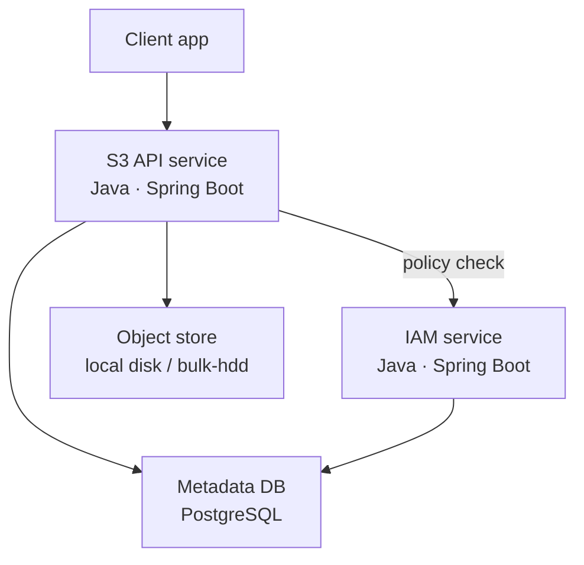
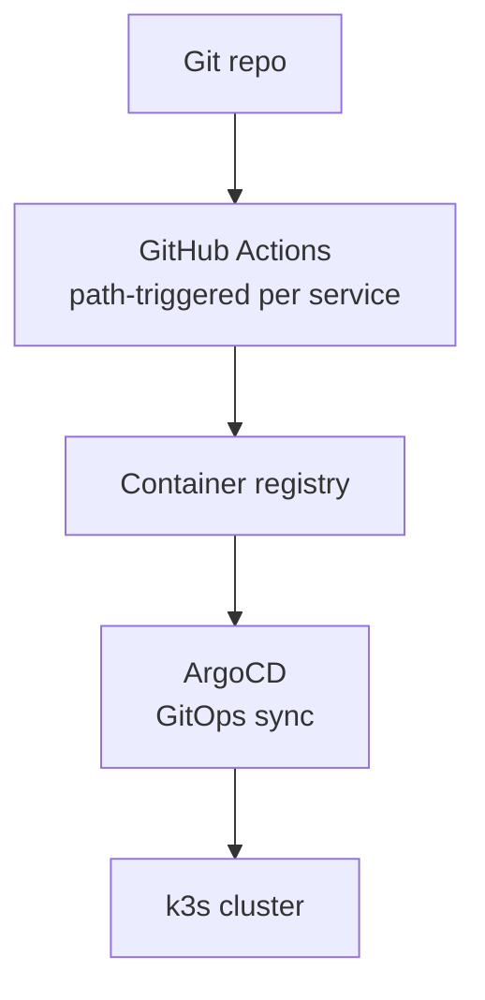

# CloudLite

A self-hosted, Kubernetes-native clone of a small slice of AWS — **S3 + IAM +
Lambda-style functions** — built to demonstrate backend engineering and
platform/SRE engineering depth from a single codebase, running on a single
bare-metal k3s node.

Two services (S3, IAM) with a real policy-evaluation dependency between them,
deployed through Helm + ArgoCD GitOps + GitHub Actions CI, observed with
Prometheus/Grafana/Loki, and exercised by a repeatable chaos suite — the same
repo telling a backend story (multipart upload with crash recovery, a
deny-overrides-allow policy engine) or a platform story (GitOps, chaos,
recovery times) depending on the interview.

Full design rationale lives in [`docs/architecture.md`](docs/architecture.md)
and [`docs/decisions/`](docs/decisions/) (one ADR per major decision — why
Java, why bare-metal k3s, why PLG over ELK, etc.).

## Architecture


```mermaid
flowchart TD
    Client["Client app"] --> S3["S3 API service<br/>Java · Spring Boot"]
    S3 -->|policy check| IAM["IAM service<br/>Java · Spring Boot"]
    S3 --> Obj["Object store<br/>local disk / bulk-hdd"]
    S3 --> Meta["Metadata DB<br/>PostgreSQL"]
    IAM --> Meta
```


```mermaid
flowchart TD
    Git["Git repo"] --> CI["GitHub Actions<br/>path-triggered per service"]
    CI --> Reg["Container registry"]
    Reg --> Argo["ArgoCD<br/>GitOps sync"]
    Argo --> Cluster["k3s cluster"]
```

## Status

Built in dependency order — see [`docs/architecture.md` §11](docs/architecture.md#11-build-order)
for the full plan.

| Layer | Status |
|---|---|
| S3 clone (bucket CRUD, object PUT/GET/DELETE/HEAD) | ✅ Built (Java/Spring Boot) |
| S3 multipart upload with crash recovery (resumable parts, atomic + idempotent complete, reconciler) | ✅ Built |
| S3 byte-range GET, versioning, custom tags | ⏸️ Deferred — see [`docs/future-work.md`](docs/future-work.md) |
| IAM clone (users/roles/policies, deny-overrides-allow engine, JWT auth) | ✅ Built |
| IAM wired into S3 (policy check on every request, fails closed with 503) | ✅ Built |
| Helm charts (umbrella chart, per-service subcharts) | ✅ Built |
| CI/CD (GitHub Actions, path-triggered) | ✅ Built |
| ArgoCD GitOps sync | ✅ Built |
| Sealed Secrets | ✅ Built |
| Prometheus + Grafana + Loki observability | ✅ Built |
| Chaos test (kill IAM / S3 / Postgres, S3 mid-PUT, S3 mid-multipart) | ✅ Built |
| Deploy to the real bare-metal node | ⏳ Next — last MVP item |
| Function runner (Lambda-style, stretch goal) | ⏳ Not yet built |
| Web admin console | ⏳ Not yet built |

**MVP finish line:** S3 multipart with crash recovery (done) plus running the
whole stack — and the chaos suite — on the real bare-metal node. Everything
platform-side has so far been validated on local k3d.

Per-service status detail: [`docs/services/`](docs/services/) (`s3.md`,
`iam.md`, `fnrunner.md`, `web.md`).

## Tech stack

| Layer | Choice |
|---|---|
| S3 / IAM services | Java 21, Spring Boot (virtual threads), PostgreSQL + Flyway |
| Function runner (planned) | Go, Python guest runtime |
| Web console (planned) | React |
| Deployment | Helm (umbrella + subcharts) |
| GitOps | ArgoCD |
| CI/CD | GitHub Actions, path-triggered per service |
| Secrets | Sealed Secrets |
| Observability | Prometheus, Grafana, Loki (Grafana Alloy for log shipping) |
| Cluster | Bare-metal k3s, single node |

Rationale for each choice: [`docs/decisions/`](docs/decisions/).

## Running locally

```bash
docker compose up --build
```

Brings up Postgres, the IAM service (`:8081`), and the S3 service (`:8080`,
IAM-backed — every request except `/healthz` requires a JWT obtained from
IAM's `/auth/token`). No Kubernetes required for local dev.

For the k3s/Helm/ArgoCD deployment path, see
[`docs/platform/helm-charts.md`](docs/platform/helm-charts.md) and
[`docs/platform/argocd.md`](docs/platform/argocd.md).

## Chaos testing

```bash
chaos/run.sh              # all scenarios against the current k3d-* context
chaos/run.sh 01 05        # a subset
chaos/test/run-tests.sh   # offline unit tests, no cluster
```

Kills IAM, S3 and Postgres pods (and S3 in the middle of a PUT and of a
multipart upload), measures recovery from inside the cluster, checks S3 fails
closed while IAM is down and that no partial or orphaned data is left behind,
and writes a Markdown report to `chaos/reports/`. Details and findings:
[`docs/platform/chaos.md`](docs/platform/chaos.md); latest run:
[`chaos/reports/2026-10-06-080820-k3d-cloudlite-test.md`](chaos/reports/2026-10-06-080820-k3d-cloudlite-test.md).

## Repo structure

```
services/
├── s3/     # Java (Spring Boot) — buckets, objects, multipart, reconciler, iamclient
└── iam/    # Java (Spring Boot) — users, roles, policy engine, JWT auth
deploy/
├── helm/       # umbrella Helm chart (S3, IAM, Postgres, Prometheus, Loki, Alloy, Grafana)
└── argocd/     # ArgoCD + Sealed Secrets install, Application manifests
chaos/          # bash chaos suite: run.sh, scenarios/, lib/, test/, reports/
docs/
├── architecture.md     # full architecture and decision reference
├── future-work.md      # explicit scope fence — what's deliberately cut, and why
├── decisions/          # one ADR per major decision
├── services/           # one file per service — scope + status
├── platform/           # Helm/CI/CD/ArgoCD/observability/chaos sub-project docs
└── superpowers/        # design specs and implementation plans per sub-project
```

## Scope

What's deliberately *not* being built — and the trigger conditions that would
change that — is documented up front in
[`docs/future-work.md`](docs/future-work.md), rather than left implicit.
