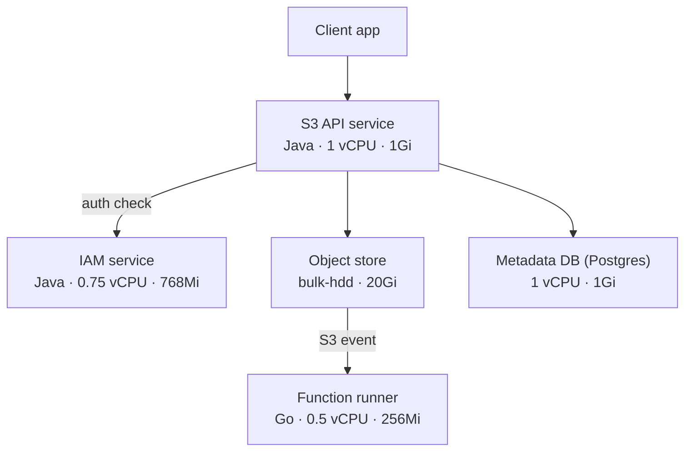
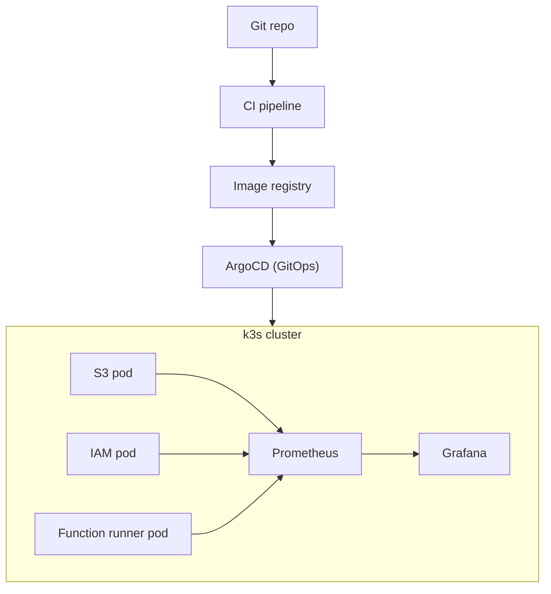

# CloudLite — Architecture Reference

A self-hosted, Kubernetes-native clone of a small slice of AWS (S3 + IAM + Lambda-style
functions), built to demonstrate both **backend engineering** and **platform/SRE
engineering** depth from a single project.

This doc is the decision record from initial planning. Hand it to future-you (or an
agentic coding session) as context before writing code.

---

## 1. Goals

- Resume project that plugs into **both** backend and DevOps/Platform/SRE interview
  tracks from one codebase.
- Learn Kubernetes (k3s) properly, not just "deployed an app to k8s once."
- Keep scope deliberately bounded — see `future-work.md` for what's explicitly cut.

## 2. Target hardware

| Resource | Spec |
|---|---|
| CPU | Ryzen 5 3500U — 4 cores / 8 threads |
| RAM | 12GB |
| SSD | 256GB |
| HDD | 1TB |

## 3. Key decisions

Full rationale, consequences, and alternatives considered for each
decision below live in [`docs/decisions/`](decisions/) as individual
ADRs — this table is a summary index, not the source of truth.

| Decision | Choice | Why | ADR |
|---|---|---|---|
| Virtualization | **Bare-metal k3s**, no Proxmox | VMs cost 2-3GB RAM in overhead before workloads even start; adds a debugging layer (VM vs app issue) that provides no resume value for this project's goals. Multi-VM "multi-node" on one physical box is also partly theater — real node-level fault isolation needs real separate hardware. | [0001](decisions/0001-bare-metal-k3s.md) |
| Backend language (S3, IAM) | **Java** (Spring Boot, Java 21+ virtual threads) | Existing strength — moves faster on the actual system-design work (multipart-upload correctness, policy engine) than learning a new language simultaneously. Virtual threads give a modern answer to Go's goroutine-style concurrency for many concurrent upload/policy-check requests. | [0013](decisions/0013-java-backend-language.md) (supersedes [0002](decisions/0002-go-backend-language.md) for S3/IAM) |
| Function runner language | **Go** | Kept separate deliberately — JVM cold-start cost is a poor fit for a per-invocation, Lambda-style executor regardless of available RAM. Legitimate polyglot decision, not an inconsistency. | [0002](decisions/0002-go-backend-language.md) |
| Function runner guest language | Python (stretch) | Realistic polyglot Lambda-style runtime; legitimate reason to touch Python without making it the primary language. | [0003](decisions/0003-python-function-runner-guest-language.md) |
| Future new services | Go, once RAM headroom allows | As hardware grows (RAM upgrade / second node), new services default to Go rather than Java — keeps growth resource-aware. | — |
| Frontend | React | Lighter fit for a small admin console (buckets, policies, invocation logs) than Angular's more enterprise-scale opinionated structure. Framework choice isn't the signal here — backend/infra is. | [0004](decisions/0004-react-frontend.md) |
| Database | PostgreSQL | Backs S3 object metadata index + IAM users/roles/policy documents. | [0005](decisions/0005-postgresql-database.md) |
| Deployment manifests | **Helm** (umbrella chart + per-service subcharts) | More resume-standard than raw YAML; solves real dev/prod values-override problem. | [0006](decisions/0006-helm-deployment-manifests.md) |
| GitOps | ArgoCD | Git-commit-triggered sync into the cluster; matches how real platform teams operate. | [0007](decisions/0007-argocd-gitops.md) |
| CI/CD | GitHub Actions, path-triggered per service | Avoids rebuilding/redeploying every service on every commit. | [0008](decisions/0008-github-actions-cicd.md) |
| Observability | **Prometheus + Grafana + Loki** (PLG stack), not ELK | ELK's minimum realistic footprint (Elasticsearch JVM heap + Logstash + Kibana) is ~5-7GB — 50-70% of the entire workload budget on this hardware. PLG stack is ~1-1.5GB combined and is the more standard choice in k8s-native shops specifically. Documented trade-off, not a default. | [0009](decisions/0009-plg-observability-stack.md) |
| Secrets | Sealed Secrets (Vault later, optional) | Keeps secrets out of plaintext values.yaml/manifests. | [0010](decisions/0010-sealed-secrets.md) |
| Repo structure | Monorepo | One coherent system to walk through in interviews; simpler CI wiring via path triggers. | [0011](decisions/0011-monorepo-structure.md) |

## 4. Storage layout

Principle: SSD for latency-sensitive/small-write workloads, HDD for bulk/sequential data.

| Storage | Lives here |
|---|---|
| **SSD (256GB)** | Host OS + k3s (control plane/datastore), container image layers, Postgres data dir, CI/build workspace, source code |
| **HDD (1TB)** | Object store blob data (S3 clone payload), Prometheus/Loki long-term retention, backups/snapshots |

Expressed in Kubernetes as two `StorageClass` resources (`fast-ssd`, `bulk-hdd`) backed by
`local-path-provisioner` pointed at different host mount paths. See §7.

## 5. Service boundaries

### S3 clone (anchor service, build first)
- Buckets: create/list/delete, per-bucket policy attachment
- Objects: PUT/GET/DELETE/HEAD, byte-range GET
- Multipart upload: initiate → upload parts → complete/abort, **with crash recovery**
  (kill mid-upload, verify clean retry or orphan cleanup — best interview anecdote in
  the project)
- Versioning: keep prior versions, list, restore
- Metadata: content-type, custom tags
- Backend: local disk (content/UUID-addressed) + Postgres for the object/bucket index

### IAM clone (build second, wires into S3)
- Users/roles with attached JSON policy documents (`Effect`/`Action`/`Resource` shape)
- Policy evaluation engine — deny-overrides-allow logic
- API key / JWT auth for service-to-service calls
- S3 calls out to IAM on every request via a dedicated `iamclient` package

### Function runner (stretch goal, build last)
- Upload a function, trigger on S3 object-created events
- Isolated per-invocation execution (cold starts, sandboxing, timeouts)
- Per-invocation log capture, viewable via API

## 6. Application architecture



S3 and IAM are Java (Spring Boot); the function runner is deliberately Go, since JVM
cold-start cost is a poor fit for a per-invocation executor regardless of available
RAM. New services added later default to Go once RAM headroom allows (see §3).

## 7. Infrastructure architecture



Terraform/Ansible provisions the k3s node itself, prior to ArgoCD ever being installed
(not shown above — that's a one-time provisioning step, not part of the steady-state
deploy loop).

## 8. Server capacity budget

| Region | Allocation |
|---|---|
| Host total | 4 cores / 8 threads, 12Gi RAM |
| System reserved (OS + k3s) | ~1 core, 2Gi |
| Available for pods | ~3 cores, ~10Gi limit |

| Pod | Language | Resource limit |
|---|---|---|
| S3 API | Java | 1 vCPU · 1Gi |
| IAM | Java | 0.75 vCPU · 768Mi |
| Function runner | Go | 0.5 vCPU · 256Mi |
| Postgres | — | 1 vCPU · 1Gi |
| Monitoring (Prometheus+Grafana) | — | 0.75 vCPU · 768Mi |
| Web UI | — | 0.25 vCPU · 128Mi |
| ArgoCD (trimmed: controller + repo-server + server + redis) | — | ~1.05 vCPU · ~1.2Gi |
| Sealed Secrets controller | — | 100m · 128Mi |
| **Total (limits, burst)** | | **~5.4 vCPU · ~5.0Gi** |

Requests (guaranteed, roughly half of limits) comfortably fit the ~3 core / 10Gi budget.
Limits now run well past the "safe" 3-core line (~5.4 vCPU vs. ~3 available, roughly
80% over) — still fine in practice, since limits are burst ceilings, not concurrent
guarantees, and none of these components (JVM services, ArgoCD, Sealed Secrets) sustain
their full limit simultaneously in normal operation. Worth re-measuring under real load
once observability (Prometheus) lands, rather than treating this budget as final. RAM has
generous headroom either way.

**JVM-specific tuning notes:**
- Set `-Xmx` explicitly to match container memory limits — the JVM has historically not
  respected container limits well unless told to.
- Bump `readinessProbe`/`livenessProbe` `initialDelaySeconds` to 5-10s (vs. Go's
  near-instant startup) to avoid crash-looping healthy pods during JVM warm-up.

## 9. Repo structure

```
cloudlite/
├── services/
│   ├── s3/            # Java (Spring Boot) — controller/, service/, repository/, iamclient/
│   ├── iam/            # Java (Spring Boot) — controller/, policy/, repository/
│   └── fnrunner/        # Go — cmd/, internal/{executor,trigger}  [stretch]
├── web/                 # React admin console
├── deploy/
│   ├── terraform/       # provisions the k3s node itself
│   ├── helm/
│   │   └── cloudlite/   # umbrella chart
│   │       ├── Chart.yaml
│   │       ├── values.yaml
│   │       ├── values-dev.yaml
│   │       ├── charts/{s3,iam,fnrunner,web}/
│   │       └── templates/{ingress.yaml, storageclasses.yaml}
│   └── argocd/
│       ├── install/               # trimmed argocd-install.yaml, sealed-secrets-install.yaml
│       ├── repo-credentials-secret.yaml.example
│       └── applications/
├── .github/workflows/    # ci-java-service.yml (reusable), ci-s3.yml, ci-iam.yml,
│                         # ci-helm.yml (path-triggered); ci-fnrunner.yml/ci-web.yml pending those services
├── docker-compose.yml    # local dev loop, no k8s
├── docs/
│   ├── architecture.md   # this file
│   ├── future-work.md    # explicit scope fence
│   ├── decisions/        # one ADR per major decision (§3)
│   ├── services/         # one file per service — scope + status
│   ├── platform/         # one file per platform-layer sub-project — Helm charts, CI/CD, ArgoCD, observability, etc.
│   └── superpowers/       # AI-session design docs (specs/) and plans (plans/)
├── CLAUDE.md
└── README.md
```

## 10. Helm chart notes

- One `helm install cloudlite` brings up the whole platform — umbrella chart with
  per-service subcharts, each independently testable (`helm template charts/s3`).
- `values-dev.yaml` layers dev-specific overrides (replica count, PVC size) over shared
  defaults — never fork the chart per environment.
- S3's PVC uses `storageClassName: bulk-hdd`; Postgres would use `fast-ssd`.
- Secrets injected via `envFrom.secretRef`, never inline in values files.
- `readinessProbe`/`livenessProbe` hit `/healthz` — build this endpoint into every Go
  service from day one (code-first, infra-aware).
- Establish a values-key naming convention early (e.g. `s3.persistence.size`,
  `iam.replicaCount`) before it gets messy across subcharts.

## 11. Build order

1. S3 clone standalone (no auth) — get object/multipart/versioning logic solid, tested
   locally via `docker-compose` + curl/test scripts.
2. IAM clone standalone — policy engine unit-tested in isolation.
3. Wire IAM into S3 — every S3 call now goes through policy evaluation.
4. Platform layer: k3s + Helm + ArgoCD + CI/CD + Prometheus/Grafana + chaos test.
5. (Stretch) Function runner triggered by S3 events.

Code first, infra-aware: externalize config via env vars, use structured (JSON)
logging, and expose `/health` from line one — even before any container or manifest
exists. Retrofitting these later is far more annoying than building them in from the
start.

## 12. Interview narrative

- **Backend angle:** "I built an S3 clone and tested crash-consistency during
  multipart uploads" / "here's how my IAM policy engine resolves conflicting
  allow/deny statements."
- **SRE angle:** "Here's my GitOps pipeline, here's the chaos test I ran, here's the
  recovery time" / "here's what happens when the IAM service goes down and S3 starts
  failing auth checks."
- Same repo, two different 90-second pitches depending on the room.

## 13. Scaling beyond this hardware (reference, not a plan)

If revisiting this later on better hardware and wanting the "full industry
experience" (RHEL + full ELK stack instead of PLG):

| Tier | CPU | RAM | Storage | Notes |
|---|---|---|---|---|
| Single-box minimum | 4 cores | 16GB | 250GB SSD/NVMe | Elasticsearch wants 4-8GB dedicated JVM heap alone |
| Single-box comfortable | 8 cores | 32GB | 500GB+ NVMe | |
| 3-node HA cluster (industry-realistic) | 12 cores total | 48GB total | 750GB+ total | Real ELK deployments run ≥3 ES nodes for quorum; this is homelab-server territory (refurbished enterprise server or 3 mini-PCs), not a laptop |

Not in scope for this project — noted here only so the trade-off is documented for a
future revisit.