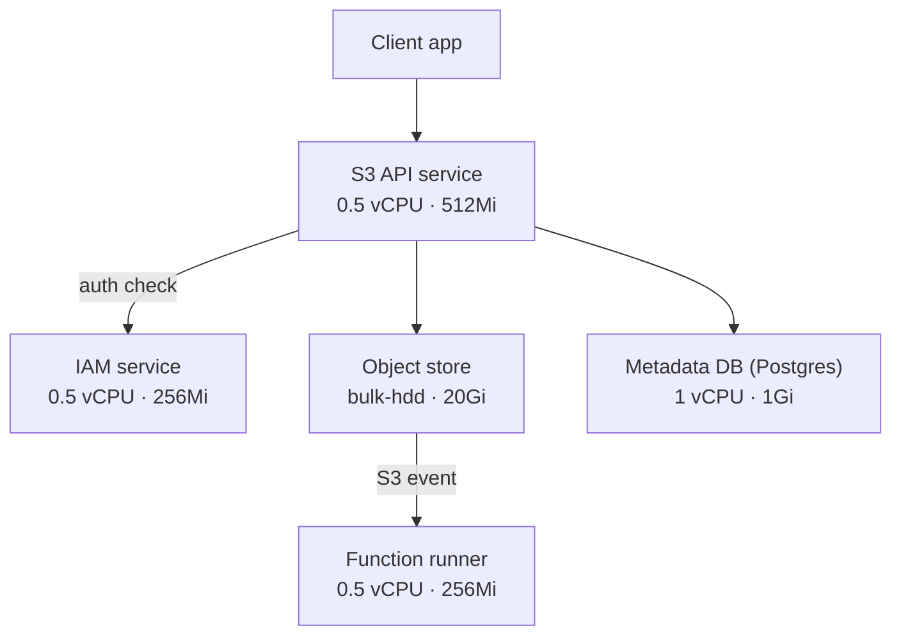
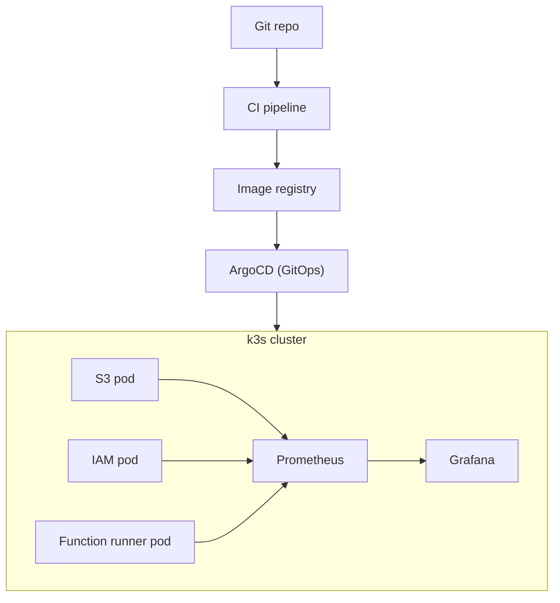

# CloudLite — Architecture Reference

A self-hosted, Kubernetes-native clone of a small slice of AWS (S3 + IAM + Lambda-style
functions), built to demonstrate both **backend engineering** and **platform/SRE
engineering** depth from a single project.

This doc is the decision record from initial planning. Hand it to future-you (or an
agentic coding session) as context before writing code.

---

## 1. Goals

- Resume project that plugs into **both** backend and DevOps/Platform/SRE interview
  tracks from one codebase.
- Learn Kubernetes (k3s) properly, not just "deployed an app to k8s once."
- Keep scope deliberately bounded — see `future-work.md` for what's explicitly cut.

## 2. Target hardware

| Resource | Spec |
|---|---|
| CPU | Ryzen 5 3500U — 4 cores / 8 threads |
| RAM | 12GB |
| SSD | 256GB |
| HDD | 1TB |

## 3. Key decisions

| Decision | Choice | Why |
|---|---|---|
| Virtualization | **Bare-metal k3s**, no Proxmox | VMs cost 2-3GB RAM in overhead before workloads even start; adds a debugging layer (VM vs app issue) that provides no resume value for this project's goals. Multi-VM "multi-node" on one physical box is also partly theater — real node-level fault isolation needs real separate hardware. |
| Backend language | **Go** (S3, IAM, function runner) | Matches the language of the ecosystem being operated (k8s, Docker, Prometheus, ArgoCD, Terraform providers). Native concurrency fits multipart uploads and policy-check request handling. Static binaries → tiny images, which matters on constrained storage/RAM. |
| Function runner guest language | Python (stretch) | Realistic polyglot Lambda-style runtime; legitimate reason to touch Python without making it the primary language. |
| Frontend | React | Lighter fit for a small admin console (buckets, policies, invocation logs) than Angular's more enterprise-scale opinionated structure. Framework choice isn't the signal here — backend/infra is. |
| Database | PostgreSQL | Backs S3 object metadata index + IAM users/roles/policy documents. |
| Deployment manifests | **Helm** (umbrella chart + per-service subcharts) | More resume-standard than raw YAML; solves real dev/prod values-override problem. |
| GitOps | ArgoCD | Git-commit-triggered sync into the cluster; matches how real platform teams operate. |
| CI/CD | GitHub Actions, path-triggered per service | Avoids rebuilding/redeploying every service on every commit. |
| Observability | **Prometheus + Grafana + Loki** (PLG stack), not ELK | ELK's minimum realistic footprint (Elasticsearch JVM heap + Logstash + Kibana) is ~5-7GB — 50-70% of the entire workload budget on this hardware. PLG stack is ~1-1.5GB combined and is the more standard choice in k8s-native shops specifically. Documented trade-off, not a default. |
| Secrets | Sealed Secrets (Vault later, optional) | Keeps secrets out of plaintext values.yaml/manifests. |
| Repo structure | Monorepo | One coherent system to walk through in interviews; simpler CI wiring via path triggers. |

## 4. Storage layout

Principle: SSD for latency-sensitive/small-write workloads, HDD for bulk/sequential data.

| Storage | Lives here |
|---|---|
| **SSD (256GB)** | Host OS + k3s (control plane/datastore), container image layers, Postgres data dir, CI/build workspace, source code |
| **HDD (1TB)** | Object store blob data (S3 clone payload), Prometheus/Loki long-term retention, backups/snapshots |

Expressed in Kubernetes as two `StorageClass` resources (`fast-ssd`, `bulk-hdd`) backed by
`local-path-provisioner` pointed at different host mount paths. See §7.

## 5. Service boundaries

### S3 clone (anchor service, build first)
- Buckets: create/list/delete, per-bucket policy attachment
- Objects: PUT/GET/DELETE/HEAD, byte-range GET
- Multipart upload: initiate → upload parts → complete/abort, **with crash recovery**
  (kill mid-upload, verify clean retry or orphan cleanup — best interview anecdote in
  the project)
- Versioning: keep prior versions, list, restore
- Metadata: content-type, custom tags
- Backend: local disk (content/UUID-addressed) + Postgres for the object/bucket index

### IAM clone (build second, wires into S3)
- Users/roles with attached JSON policy documents (`Effect`/`Action`/`Resource` shape)
- Policy evaluation engine — deny-overrides-allow logic
- API key / JWT auth for service-to-service calls
- S3 calls out to IAM on every request via `internal/iamclient`

### Function runner (stretch goal, build last)
- Upload a function, trigger on S3 object-created events
- Isolated per-invocation execution (cold starts, sandboxing, timeouts)
- Per-invocation log capture, viewable via API

## 6. Application architecture



## 7. Infrastructure architecture



Terraform/Ansible provisions the k3s node itself, prior to ArgoCD ever being installed
(not shown above — that's a one-time provisioning step, not part of the steady-state
deploy loop).

## 8. Server capacity budget

| Region | Allocation |
|---|---|
| Host total | 4 cores / 8 threads, 12Gi RAM |
| System reserved (OS + k3s) | ~1 core, 2Gi |
| Available for pods | ~3 cores, ~10Gi limit |

| Pod | Resource limit |
|---|---|
| S3 API | 0.5 vCPU · 512Mi |
| IAM | 0.5 vCPU · 256Mi |
| Function runner | 0.5 vCPU · 256Mi |
| Postgres | 1 vCPU · 1Gi |
| Monitoring (Prometheus+Grafana) | 0.75 vCPU · 768Mi |
| Web UI | 0.25 vCPU · 128Mi |
| **Total (limits, burst)** | **~3.5 vCPU · ~2.9Gi** |

Requests (guaranteed, roughly half of limits) comfortably fit the ~3 core / 10Gi budget.
Limits slightly exceed the "safe" 3-core line, which is fine — limits are burst
ceilings, not concurrent guarantees, and 8 threads give the scheduler room to interleave.

## 9. Repo structure

```
cloudlite/
├── services/
│   ├── s3/            # Go — cmd/, internal/{api,storage,metadata,iamclient}
│   ├── iam/            # Go — cmd/, internal/{api,policy,store}
│   └── fnrunner/        # Go — cmd/, internal/{executor,trigger}  [stretch]
├── web/                 # React admin console
├── deploy/
│   ├── terraform/       # provisions the k3s node itself
│   ├── helm/
│   │   └── cloudlite/   # umbrella chart
│   │       ├── Chart.yaml
│   │       ├── values.yaml
│   │       ├── values-dev.yaml
│   │       ├── charts/{s3,iam,fnrunner,web}/
│   │       └── templates/{namespace.yaml, ingress.yaml, storageclasses.yaml}
│   └── argocd/applications/
├── .github/workflows/    # ci-s3.yml, ci-iam.yml, ci-fnrunner.yml, ci-web.yml (path-triggered)
├── docker-compose.yml    # local dev loop, no k8s
├── docs/                 # this file + future-work.md
└── README.md
```

## 10. Helm chart notes

- One `helm install cloudlite` brings up the whole platform — umbrella chart with
  per-service subcharts, each independently testable (`helm template charts/s3`).
- `values-dev.yaml` layers dev-specific overrides (replica count, PVC size) over shared
  defaults — never fork the chart per environment.
- S3's PVC uses `storageClassName: bulk-hdd`; Postgres would use `fast-ssd`.
- Secrets injected via `envFrom.secretRef`, never inline in values files.
- `readinessProbe`/`livenessProbe` hit `/healthz` — build this endpoint into every Go
  service from day one (code-first, infra-aware).
- Establish a values-key naming convention early (e.g. `s3.persistence.size`,
  `iam.replicaCount`) before it gets messy across subcharts.

## 11. Build order

1. S3 clone standalone (no auth) — get object/multipart/versioning logic solid, tested
   locally via `docker-compose` + curl/test scripts.
2. IAM clone standalone — policy engine unit-tested in isolation.
3. Wire IAM into S3 — every S3 call now goes through policy evaluation.
4. Platform layer: k3s + Helm + ArgoCD + CI/CD + Prometheus/Grafana + chaos test.
5. (Stretch) Function runner triggered by S3 events.

Code first, infra-aware: externalize config via env vars, use structured (JSON)
logging, and expose `/health` from line one — even before any container or manifest
exists. Retrofitting these later is far more annoying than building them in from the
start.

## 12. Interview narrative

- **Backend angle:** "I built an S3 clone and tested crash-consistency during
  multipart uploads" / "here's how my IAM policy engine resolves conflicting
  allow/deny statements."
- **SRE angle:** "Here's my GitOps pipeline, here's the chaos test I ran, here's the
  recovery time" / "here's what happens when the IAM service goes down and S3 starts
  failing auth checks."
- Same repo, two different 90-second pitches depending on the room.

## 13. Scaling beyond this hardware (reference, not a plan)

If revisiting this later on better hardware and wanting the "full industry
experience" (RHEL + full ELK stack instead of PLG):

| Tier | CPU | RAM | Storage | Notes |
|---|---|---|---|---|
| Single-box minimum | 4 cores | 16GB | 250GB SSD/NVMe | Elasticsearch wants 4-8GB dedicated JVM heap alone |
| Single-box comfortable | 8 cores | 32GB | 500GB+ NVMe | |
| 3-node HA cluster (industry-realistic) | 12 cores total | 48GB total | 750GB+ total | Real ELK deployments run ≥3 ES nodes for quorum; this is homelab-server territory (refurbished enterprise server or 3 mini-PCs), not a laptop |

Not in scope for this project — noted here only so the trade-off is documented for a
future revisit.
